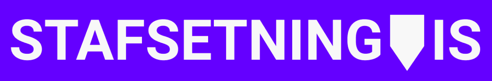

# Stafsetning.is Frontend

The full-fledged frontend for stafsetning.is

* [Setup](#setup)
* [User manual](#user-manual)
* [License](#license)

## Setup

**Note: Head straight to step 5 to skip any installation steps**

To setup on a local machine follow these steps.

**1.** Open your favorite terminal and clone the repository to a directory with SSH or with HTTPS. Navigate to the newly created repository

`$ git clone git@github.com:Stafsetning-is/stafsetning-frontend.git`

`$ git clone https://github.com/Stafsetning-is/stafsetning-frontend.git`

`$ cd stafsetning-frontend`

**2.** Install all the necessary dependencies with npm. If you don't have npm, head to the [NodeJS website](https://nodejs.org/en/download/) and follow the steps to install Node which comes with npm. Write in your terminal:

`$ npm install`

**3.** An environment variable is needed to run the application. Add a .env file with the required variable:

`$ echo "SKIP_PREFLIGHT_CHECK=true" > .env`

**4.** Start up the application with npm

`$ npm run dev`

The default web browser should open displaying the application at localhost:3000. 

**5.** Alternatively you can check out the application with the link at the top of the repository page.

## User manual

To start using the application you need to register or sign in which can be done in the top right corner in the header.

Here is shown a simple example of how you can start an exercise. When the exercise has been opened, simply start typing away! If you forgot what you were supposed to write you can check it out with the green button on the right. Beware though above that there is an error counter that counts the errors you made in the exercise. Try to get as few as possible for a better score!

For a personal and helpful experience while practicing check out the menu to the left of the textbox. If you're still struggling to keep up with that you're supposed to be typing you can control the time limit of the on-screen text, or remove the time limit completely. If the font size or the background color is not cutting it for you, that can also easily be changed. You can even choose to have a keyboard to appear at the bottom of the textbox highlighting the keys to press next. Try it out yourself to see what fits best!

Find that there are too many exercises you wan't to try out and you can't get through them all? The star in the upper corner of each exercises can be clicked to save the exercise for later. Head to the profile page (or the filter, explained below) to check out your saved exercises under the middle tab. On your user profile you can also see past attempts at exercises as well as trophies and achievements you have earned on the way.

If there are any particular grammar rules you would like to test your skills against you can head to the filter option on the left side of the front page. The filter allows you to filter the exercises by certain grammar rules and also show or hide the ones you've already completed or saved.

## License
Usage is provided under the [MIT License](https://opensource.org/licenses/MIT). See LICENSE for the full details.
